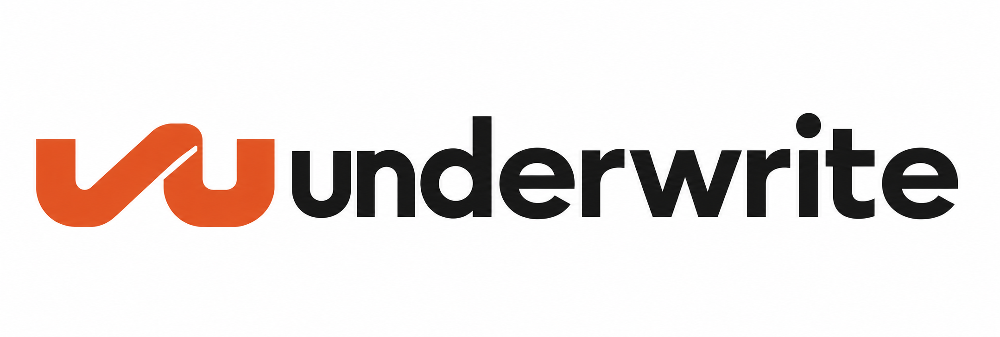

<div align="center">

<h1></h1>

**평가 아티팩트를 검토 가능한 근거로 연결합니다.**

지원되는 로컬 아티팩트를 검사하고, 네이티브 근거 번들을 명시적 정책으로 측정하며,
선언된 측정 결과를 바탕으로 변경 후보를 분류합니다.

[](https://github.com/ntts9990/underwrite/actions/workflows/ci.yml)
[](https://pypi.org/project/underwrite/)
[](https://pypi.org/project/underwrite/)
[](LICENSE)

[English](README.md) · **한국어**

[설치](#설치) · [빠른 시작](#빠른-시작) · [에이전트 사용](AGENT_USAGE.md) · [지원 형식](#지원-형식) · [CLI](#cli) · [기여 안내](CONTRIBUTING.md)

</div>

## 왜 underwrite인가요?

평가 결과가 변경을 뒷받침하려면 그 결과의 맥락부터 확인해야 합니다. underwrite는
로컬 근거를 명시적 측정·수락 정책에 연결하는 Python CLI이자 라이브러리입니다.
근거가 빠진 경우도 결과에 그대로 드러냅니다.

- **하나의 관측 계약.** 지원하는 페이로드를 정규화하면서 원천 주장을 측정 결론과 구분합니다.
- **명시적 측정.** 입력, 대상, 보정, 정족수, 통계 임계값을 정책에 선언합니다.
- **드러나는 불확실성.** `not_measured`, `indeterminate`, `abstained`를 구분합니다. 행동에 옮기기 전에 결과를 확인하세요.

```text
네이티브 근거 번들 → ingest → observation → measure + 정책 → read
후보 + 주장 + 제공된 reads → accept → 분류 결과

지원되는 외부 export → ingest → observation (원천 주장과 바이트 동일성만 기록)
```

지원되는 외부 관측은 현재 측정 경로로 이어지지 않습니다. 유효한 정책을 제공해도
`measure`는 `UNSUPPORTED_PROFILE`을 반환하며 read를 만들지 않습니다. 구체적인 예시는
[에이전트 사용 안내](AGENT_USAGE.md)를 참고하세요.

콘텐츠 해시는 바이트의 동일성을 식별하며, 독립적인 출처 증명은 아닙니다.
종료 코드 `0`은 명령이 결과를 생성했다는 뜻이지, 변경이 승인되었다는 뜻이 아닙니다.

## 설치

Python **3.12 이상**과 [uv](https://docs.astral.sh/uv/)가 필요합니다.

```sh
uv tool install 'underwrite==0.0.1'
underwrite --help
```

[underwrite](https://pypi.org/project/underwrite/0.0.1/)와
[underwrite-core](https://pypi.org/project/underwrite-core/0.0.1/) 모두 PyPI에서 wheel과
소스 배포본으로 제공됩니다. 코어 패키지는 Python 표준 라이브러리만 사용하며,
애플리케이션 어댑터가 로컬 입출력과 스키마 검증을 담당합니다.

## 빠른 시작

소스 체크아웃에서 포함된 합성 예제로 네이티브 전체 경로를 실행합니다. 인접한
다른 저장소를 체크아웃할 필요는 없습니다.

```sh
git clone https://github.com/ntts9990/underwrite.git
cd underwrite
uv sync --frozen --all-groups
mkdir -p output

uv run --frozen --no-sync underwrite ingest \
  --format underwrite.evidence-bundle --version v1 \
  --file fixtures/examples/measurement/bundle.json --json \
  > output/observation.json

uv run --frozen --no-sync underwrite measure \
  --observation output/observation.json \
  --policy fixtures/examples/acceptance/policy-quality.json --json \
  > output/read-quality.json

uv run --frozen --no-sync underwrite measure \
  --observation output/observation.json \
  --policy fixtures/examples/acceptance/policy-latency.json --json \
  > output/read-latency.json

uv run --frozen --no-sync underwrite accept \
  --candidate fixtures/examples/acceptance/candidate.json \
  --claims fixtures/examples/acceptance/claims.json \
  --read output/read-quality.json \
  --read output/read-latency.json --json
```

측정 결과(read)는 제공된 번들과 정책으로 계산됩니다. 최종 결과는 `screened`이며,
사람의 검토가 필요하고 `merge_authorized`는 false로 유지됩니다. 필요한 주장마다
`--read`를 반복해 전달합니다. 분류에 성공했다고 병합이나 배포가 허가되는 것은 아닙니다.

로컬 내보내기를 다루는 코딩 에이전트라면 [에이전트 사용 안내](AGENT_USAGE.md)의 명령,
결과 해석, 재사용 가능한 작업 지시문을 참고하세요. 아래 외부 형식은 ingest할 수 있지만
현재 `measure`는 네이티브 근거 번들 관측만 받습니다. ingest 성공만으로 외부 원천
주장을 측정할 수 있게 되는 것은 아닙니다.

## 지원 형식

형식과 정확한 지원 버전을 명시적으로 선택합니다.

| 생성 도구 | `--format` | `--version` |
| --- | --- | --- |
| DeepEval | `deepeval.test-run` | `4.1.1` |
| Inspect AI | `inspect.eval-log` | `0.3.263` |
| Langfuse | `langfuse.observations-v2` 또는 `langfuse.scores` | `4.35.0` |
| OpenInference | `openinference.traces` | `0.1.38` |
| OTLP JSON | `otlp-json.traces` | `0.160.0` |
| promptfoo | `promptfoo.eval-output` | `0.123.0` |
| 네이티브 근거 번들 | `underwrite.evidence-bundle` | `v1` |

지원 범위는 위 페이로드 프로필로 한정됩니다. 각 도구의 모든 내보내기 형식이나 버전과의
호환성을 뜻하지 않습니다. 네이티브 번들은
`schema_version: underwrite.evidence-bundle.v1`을 선언하고, readings·원천 주장·가용성
기록을 담습니다. 관측(observation)은 원천 주장을 측정과 구분해 보존합니다.

`project`는 `ingest`의 명시적 별칭입니다. `--http-body-file FILE`은 이미 캡처된 HTTP
본문을 로컬 파일에서 읽으며 URL을 호출하지 않습니다. 선택 인자 `--source-ref`와
`--source-locator`는 제공된 원본을 기술합니다. 원본 참조가 없으면 바이트의 동일성으로
콘텐츠 해시를 사용합니다. 입력 크기와 깊이 제한은 `ingest --help`에서 확인하세요.

<details>
<summary>잘못된 입력 실행하기: 타입이 명시된 오류와 빈 stdout</summary>

빈 실행 식별자는 유효하지 않습니다. 다음 예제는 관측을 생성하지 않고 오류를 캡처합니다.

```sh
mkdir -p output
printf '%s\n' '{"schema_version":"underwrite.evidence-bundle.v1","run_id":"","sources":[],"readings":[],"availability":[]}' \
  > output/malformed-bundle.json
if uv run --frozen --no-sync underwrite ingest \
  --format underwrite.evidence-bundle --version v1 \
  --file output/malformed-bundle.json --json \
  > output/malformed.stdout 2> output/malformed.stderr; then
  ingest_exit=0
else
  ingest_exit=$?
fi
printf 'exit: %s\n' "$ingest_exit"
wc -c < output/malformed.stdout
cat output/malformed.stderr
```

예상 결과는 종료 코드 `1`, stdout 크기 `0`, 그리고 stderr의 다음 JSON입니다.

```json
{"schema":"instrument_error.v1","command":"ingest","code":"INVALID_INPUT","reason":"MALFORMED_EVIDENCE_BUNDLE_PAYLOAD","exit_code":1}
```

</details>

## CLI

옵션은 `underwrite --help` 또는 `underwrite <command> --help`로 확인하세요. 빠른 시작의
`ingest`, `measure`, `accept` 외에 다음 검사 명령을 제공합니다.

| 명령 | 용도 |
| --- | --- |
| `inspect CASE.json --json` | 로컬 아티팩트 매니페스트와 투영 결과를 검사합니다. |
| `check RELEASE.json --json` | 릴리스 매니페스트에 선언된 근거 연결과 기록 존재 여부를 검사합니다. |
| `absence --root DIR --glob '*.json' --min 1 --json` | 모집단이 비어 있지 않은지 검사합니다. |
| `boundary scan DIR --json` | JSON/JSONL 문자열에서 설정된 판정 어휘를 검사합니다. |
| `drift check --pins-root PINS --siblings-root SOURCES --json` | 제공된 핀 등록부를 로컬 원본 체크아웃과 비교합니다. |
| `pins refresh --repo NAME --pins-root PINS --siblings-root SOURCES` | 설정된 저장소의 핀을 로컬 바이트로 갱신합니다. |

아티팩트·릴리스 검사는 독립적인 출처 증명이나 배포 허가를 제공하지 않습니다.
핀 명령은 범용 유틸리티이며, 미리 설정된 원본 등록부는 포함하지 않습니다. 허용 목록이나
면제를 평가할 때는 해당되는 경우 `--now`를 명시해야 합니다. 잘못된 입력과 없는 경로는
통과로 처리하지 않고 구성 오류로 남깁니다.

각 명령 계열의 출력과 오류는 [JSON 계약](contracts/)에 정의되어 있습니다.

선택 설치형 [underwrite-review 스킬](skills/underwrite-review/SKILL.md)은 에이전트가
제공된 자료에 맞는 CLI 경로를 선택하고 결과와 한계를 설명하도록 돕습니다.
[수동 설정 안내](AGENT_USAGE.md#optional-artifact-review-skill)를 참고하세요.
CLI·hook·백그라운드 서비스는 자동으로 설치하지 않습니다.

## 개발 체크아웃의 근거 검사 파일럿

이 체크아웃에는 집계 검사용 `audit-counts`, 선언 비교용
`compare-declarations`, 쌍대 이진 근거 계산용 `pair-binary`가 추가되어 있습니다.
서버 없이 로컬에서 JSON으로 실행합니다. 재현 명령과 한계는
[에이전트 사용 안내](AGENT_USAGE.md#source-checkout-pilot-audit-promptfoo-counts)에 있습니다.
아직 릴리스하지 않은 변경이며, 기존 PyPI `0.0.1` 배포물은 그대로입니다.
이 보고서는 승인을 부여하지 않으며 기존 `accept` 흐름의 입력이 아닙니다.

## 기여

개발 검사와 기여 절차는 [CONTRIBUTING.md](CONTRIBUTING.md), 비공개 취약점 신고는
[SECURITY.md](SECURITY.md), 기술적 경계는 [AGENTS.md](AGENTS.md)를 참고하세요.

<details>
<summary>유지관리자 안내: 향후 PyPI 릴리스</summary>

OIDC 배포를 사용하기 전에 GitHub 환경 `pypi`를 만들고 `main`으로 제한합니다.
**각** PyPI 패키지에 GitHub Trusted Publisher를 설정합니다. 소유자는 `ntts9990`,
저장소는 `underwrite`, 워크플로는 `publish.yml`, 환경은 `pypi`입니다.
설정 후 GitHub Actions에서 `main`의 **Publish PyPI**를 수동 실행합니다.

워크플로는 두 패키지를 검증한 뒤 코어, 애플리케이션 순서로 배포합니다. 별도 배포
작업에만 OIDC 권한이 부여되며, 저장된 PyPI API 토큰은 필요하지 않습니다. 일부만
업로드됐다면 동일한 아티팩트로 재시도합니다. 이미 등록된 파일은 정확히 일치해야 하며,
아티팩트가 바뀌면 새 버전이 필요합니다.

공식 [uv 배포 가이드](https://docs.astral.sh/uv/guides/package/)와
[PyPI Trusted Publisher 가이드](https://docs.pypi.org/trusted-publishers/using-a-publisher/)를 참고하세요.

</details>

## 라이선스

[Apache-2.0](LICENSE). 적용한 정책 템플릿의 CC 라이선스는
[LICENSING.md](LICENSING.md)에 기록되어 있습니다.
